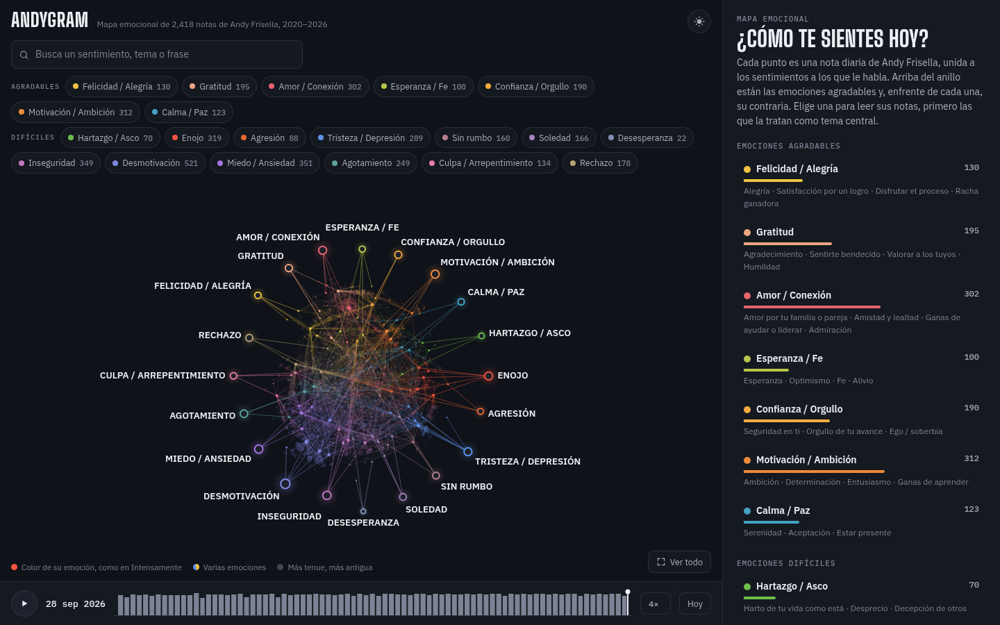

# AndyGram por emociones

Las notas diarias de Andy Frisella ([AndyGram](https://andyfrisella.com/blogs/andygram), 2,418 entradas de enero de 2020 a septiembre de 2026) organizadas por la emoción a la que le hablan, navegables como un grafo estilo Obsidian que se anima por fecha.



- **Emociones** (nodos grandes) y **sub-sentimientos** (nodos medianos): 20 emociones (7 agradables y 13 difíciles) y 77 sub-sentimientos en `data/taxonomy.json`. Las agradables van arriba del anillo y, enfrente de cada una, su contraria.
- **Colores de Intensamente**: cada emoción usa el color de su personaje (Enojo = Furia, rojo; Felicidad = Alegría, amarillo; Tristeza, azul; Miedo = Temor, morado; Hartazgo = Desagrado, verde; Desmotivación = Ennui, índigo; Culpa = Vergüenza, rosa). Las que no tienen personaje mezclan dos (Esperanza = Alegría + Desagrado; Motivación = Alegría + Furia...). Las mezclas se calculan en `scripts/colores.py`, en OKLab, con una versión para cada modo.
- **Cada punto es una nota**, del color de su emoción; si tiene varias, se dibuja partida en sus colores, como los recuerdos de la película. Más tenue = más antigua.
- **Modo claro y modo noche**, con un botón; por defecto sigue al sistema.
- Al elegir una emoción se iluminan sus notas y el panel las lista, primero las que la tratan como tema central. Al abrir una nota se lee completa, con su consejo en español.
- La línea de tiempo (▶) reconstruye el mapa día por día desde enero de 2020.
- "Notas parecidas" sale de embeddings locales (`BAAI/bge-small-en-v1.5`).

## Qué incluye este repo

| Ruta | Qué es |
|---|---|
| `scripts/` | scraper, preparación de bloques, validador de etiquetas, embeddings, visor y vault de Obsidian |
| `data/taxonomy.json` | la taxonomía de emociones |
| `data/instrucciones_etiquetado.md` | las reglas con las que se etiquetó cada nota |
| `data/tags/*.jsonl` | por nota: de 0 a 4 sub-sentimientos (peso 2 o 3) y un consejo de una línea en español |
| `data/similar.json` | las notas más parecidas a cada una |
| `scripts/colores.py` | los colores de cada emoción: personaje de Intensamente o mezcla de dos, ajustados a cada modo |
| `viewer/template.html` | el visor (force-graph en canvas), que `build_viewer.py` llena con los datos |

**Los textos de Andy no están incluidos** (`posts/` y los visores generados con ellos): tienen derechos de autor. Para reconstruir todo en tu máquina:

```bash
pip install -r requirements.txt
python3 scripts/scrape.py              # descarga las notas a posts/ (respeta el rate limit del sitio)
python3 scripts/build_viewer.py        # viewer/index.html, listo para abrir en el navegador
```

## Cómo se construyó

```bash
python3 scripts/scrape.py              # 1. descargar (2 hilos, 1 s entre requests, espera ante 429)
python3 scripts/prepare_chunks.py      # 2. partir el corpus en bloques de ~45 KB + INSTRUCCIONES.md
# 3. etiquetar: subagentes leen cada bloque y guardan con scripts/save_tags.py -> data/tags/*.jsonl
python3 scripts/embed.py               # 4. data/similar.json (vecinos más parecidos)
python3 scripts/build_viewer.py        # 5. viewer/index.html y viewer/artifact.html
python3 scripts/build_vault.py         # opcional: vault/ para abrir en Obsidian
```

El etiquetado lo hicieron 14 subagentes de Claude Code (Sonnet) en paralelo, después de una prueba que sirvió para ajustar la taxonomía. `scripts/save_tags.py` valida cada bloque antes de guardarlo (ids completos, sub-sentimientos que existen, pesos 2 o 3, consejos de 25 palabras como máximo) y acepta lotes (`--lote`) para que cada subagente guarde de 12 en 12. `progreso_etiquetado.sh` muestra el avance en vivo.

## Notas nuevas

```bash
python3 scripts/scrape.py --nuevos     # busca y baja solo las entradas nuevas
python3 scripts/prepare_chunks.py      # crea data/chunks/pendientes_AAAAMMDD.txt con las que no tienen etiquetas
# etiquetar ese archivo igual que los bloques, luego:
python3 scripts/embed.py && python3 scripts/build_viewer.py
```

## Si estás pasando por un momento difícil

El nodo **Desesperanza** incluye *pensamientos suicidas*. Solo lleva notas compasivas (por ejemplo, en las que Andy cuenta que él mismo pasó por eso y cómo salió) y, al abrirlo, el visor muestra líneas de ayuda en México: Línea de la Vida 800 911 2000 y SAPTEL 55 5259 8121, gratis y a cualquier hora; en una emergencia, 911.

## Créditos

Los textos son de Andy Frisella. Las emociones y los consejos en español los asignó un modelo de IA leyendo cada nota; pueden tener errores. El código es MIT.
